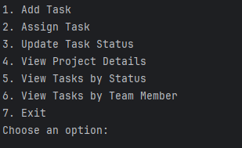

# Task Management System

### Author: Rudy S

---

## Overview

The **Task Management System** is a Java-based application that allows users to manage tasks within a project. Tasks can be categorized, assigned to team members, and tracked by their status. The system provides an interactive command-line interface (CLI) for seamless task and project management.

---

## Features

- **Task Categories**:
    - `BugFixTask`: Tasks for fixing bugs with severity levels.
    - `ReviewTask`: Tasks for reviewing code or documents with specific types.
- **Interactive CLI**:
    - Add tasks.
    - Assign tasks to team members.
    - Update task statuses.
    - View project details, tasks by status, or tasks by team member.
- **Dynamic Task Management**:
    - Leverages object-oriented principles with polymorphism and inheritance.

---

## How It Works

1. Users are prompted to select from a menu of options to manage tasks.
2. Tasks can be created, assigned, updated, or viewed based on the selected option.
3. Tasks are dynamically added to the project and displayed with their details.

---

## Classes

### 1. Task (Interface)
Defines the basic structure of a task:
- `displayTaskDetails()`: Displays task details.
- `getStatus()`: Returns the current status of the task.

### 2. AbstractTask (Abstract Class)
Provides a base implementation of `Task`:
- Includes common fields like `title`, `description`, `deadline`, etc.
- Implements common behavior for all task types.

### 3. BugFixTask
Represents tasks for fixing bugs:
- Adds a `severity` field to indicate the level of urgency.

### 4. ReviewTask
Represents tasks for reviewing code or documents:
- Adds a `reviewType` field for specific review types.

### 5. Project
Manages multiple tasks:
- Supports adding tasks, assigning team members, and updating task statuses.
- Provides filtering options for tasks by status or assigned team member.

### 6. TaskMaster
The main entry point for the application:
- Implements the CLI for task and project management.

---

## Example Usage

### Menu Options

## Sample Interactions

### Adding Tasks
  

---

### Assign / re-assign task

### Update task status

### View project details

###  View tasks by Status

### View tasks by team member

### Exit

---

## Future Enhancements

- Add persistence to save and load tasks from a file or database.
- Implement validation for user inputs to improve robustness.
- Extend task types for additional use cases (e.g., `FeatureTask`).
- Create a graphical user interface (GUI) for enhanced usability.

---

## License

This project is licensed under the MIT License. Feel free to use and modify it as needed.

